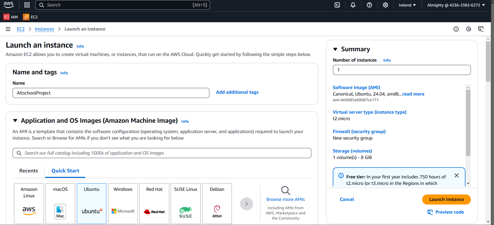

# INSTANCE IP: 34.244.67.156

# Server Setup Guide

## Project Overview
This guide outlines the steps to provision a server, set up a web server, and confirm successful installation using AWS EC2 and Nginx.

---

## Step 1: Provisioning the Server

### Choose a Cloud Platform
- **AWS (Amazon Web Services)** is used for this project.
- Sign in to your AWS account or create one if you don’t have an account yet.

### Launch an EC2 Instance
1. Navigate to the **EC2 Dashboard** in AWS.


2. Click **Launch Instance**.
3. Configure the instance:
   - **Amazon Machine Image (AMI):** Select an AMI, e.g., Ubuntu Server 20.04 LTS.
   - **Instance Type:** Choose `t2.micro` (AWS Free Tier eligible).
4. Set up the **Key Pair:**
   - Specify a key pair name, key pair type as **RSA**, and private key file format as **.pem**.
   - When done creating the key pair, the `.pem` file will be downloaded to your local machine. **NOTE:** This `.pem` file should be kept safe in your local machine. Without it, you won't be able to gain access to your instance.
5. Configure the **Security Group:**
   - Allow SSH traffic from `Anywhere` or your IP (helps you connect to your instance).
6. Configure **Storage:**
   - Leave the default storage size (8GB).
7. Launch the instance.
   - The instance will take a few minutes to initialize.

### Connect to the Server
1. Open a terminal or SSH client (e.g., Termius).
2. Change directory (cd) to the working directory where the `.pem` file is located. Without this file, connection to the instance will be unsuccessful.
3. Use the following command to connect to the instance:
   ```bash
   ssh -i "your-key-file.pem" ubuntu@<your-instance-public-ip>
   ```
   Replace `your-key-file.pem` with the path to your private key file and `<your-instance-public-ip>` with the instance’s public IP address.

---

## Step 2: Web Server Setup

### Prerequisite
Ensure the system is up-to-date.

1. **Update the System:**
   Update the instance using the command `sudo apt update` to ensure the instance is up-to-date. **Note:** I used `sudo` in the command because it's the Ubuntu user and not the root user.

2. **Install Nginx:**
   Use the command `sudo apt install nginx` to install nginx. Nginx is the software service which renders the web contents or page.

3. **Start the Nginx Service:**
   Use the command `sudo systemctl start nginx` to activate nginx.

4. **Verify Nginx is Running:**
   Use command `sudo service nginx status` to confirm nginx is active (running).
   Ensure the output shows `active (running)`.
   
5. **Check Installation**
   To confirm the above process is working properly, search the instance Public IP Address in a browser (e.g.,      `34.244.67.156` or `http://34.244.67.156`). You should see the default Nginx welcome page.
   
---
